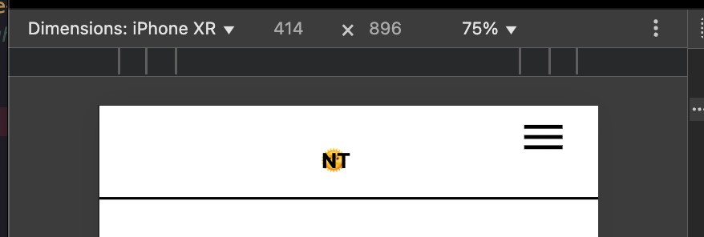
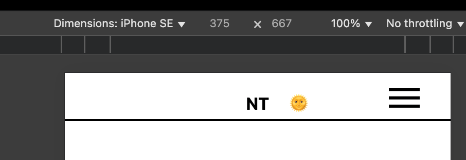
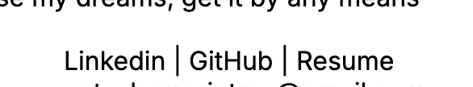
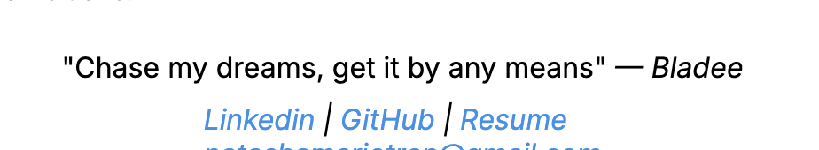
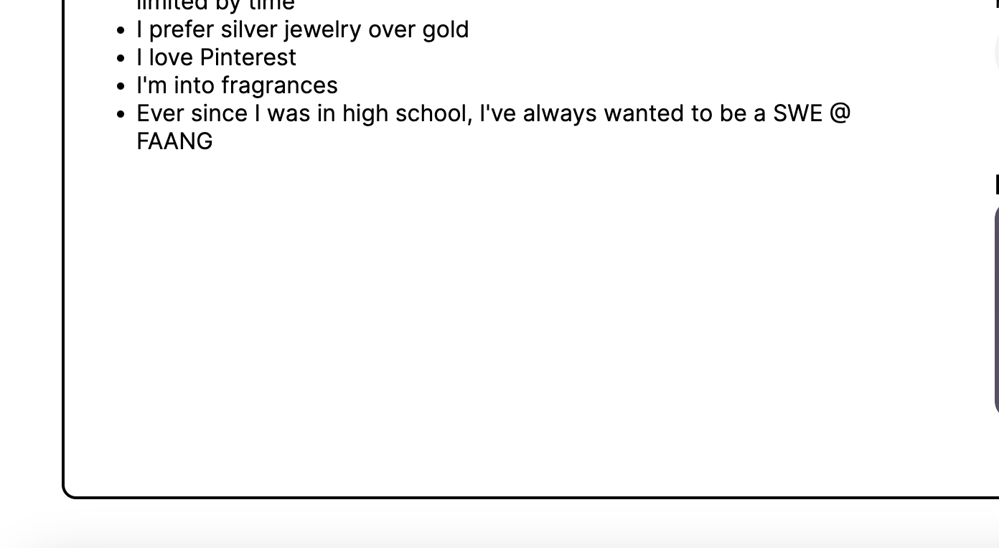
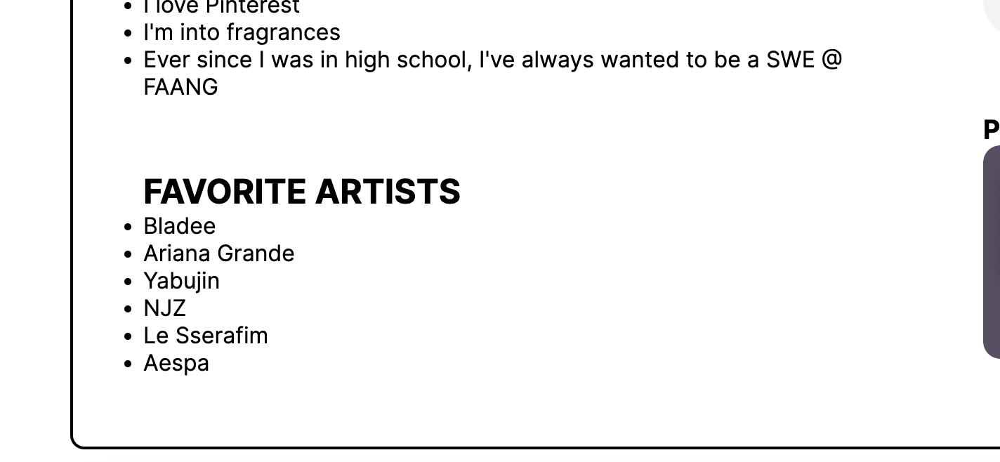

**Homework 5:**
*Part 3: Other Enhancements*

---

To enhance my website and source code, here are the changes that I believe needed improvent.

Changes Made:

- Fix light/dark mode toggle usability for mobile users
    - Prior to HW5, the toggle overlapped the "NT" logo on mobile. I fixed this issue by making a media query to adjust the toggle placement.

|Before Change|After Change|
|:-:|:-:|
|||

- Increase clarity in homepage links
    - I noticed that on my landing page (`home.html`), the links do not indicate that they are clickable. I underlined the text and made it blue so that it's clear that users can click the link.

|Before Change|After Change|
|:-:|:-:|
|||

- Add new section to about page to fill white space
    - Added favorite arists section to `about.html` to fill white space

|Before Change|After Change|
|:-:|:-:|
|||

`